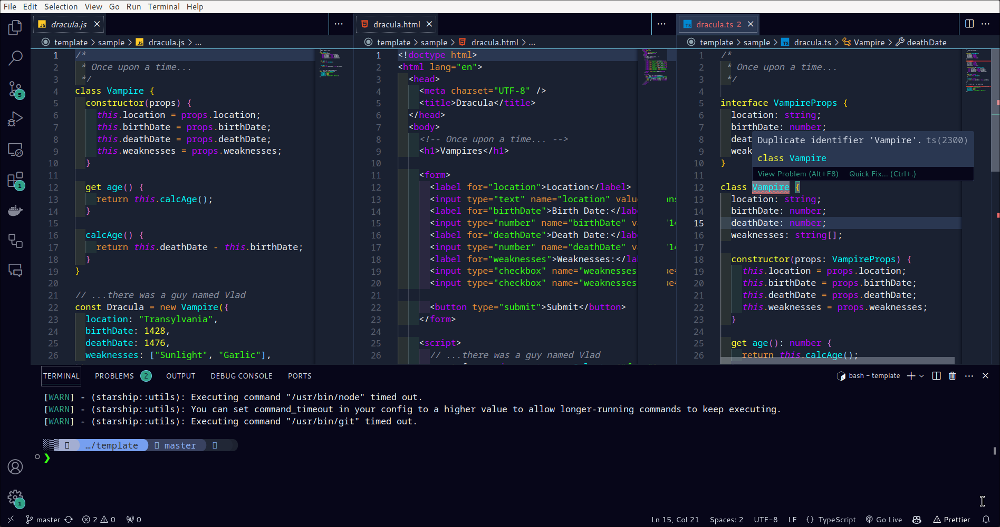

# etchmon-acid README

## Etchmon Acid is a high contrast dark theme for vscode designed and developed in consideration of the visually impared.

### List of Colors Used

- #070619
- #1a2131
- #2a3751
- #6679A4
- #D8DEE9
- #ECEFF4
- #E5E9F0
- #30a387
- #a7559b
- #6fe55a
- #ea9336
- #80e8ff
- #e8e083
- #ef6b6b
